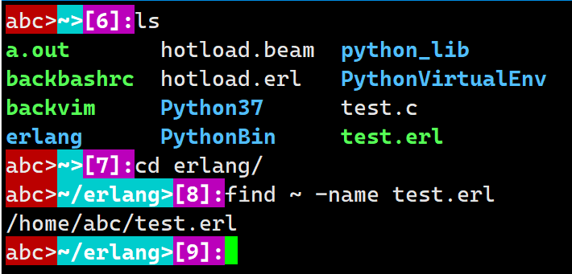
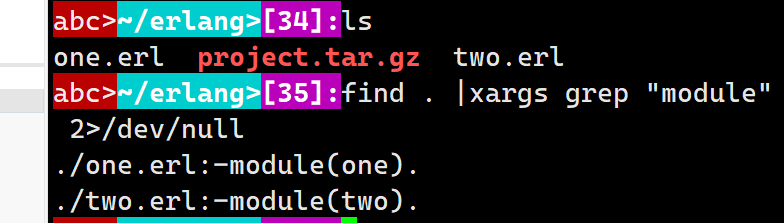

# which

寻找可执行文件的路径

```bash
which [-a] command
--------|-a 显示所有PATH目录中可以找到的命令，而不只是第一个
```


# find

寻找文件所在路径

```bash
find [PATH] [option] [action] 

关于find正则表达式
find path -regextype "posix-extended" -regex "\.(cpp|c|h)$"

1.与时间有关的选项-atime -ctime -mtime
	如:
	-mtime n: 在n天之前的一天之内被更改过内容的文件
	-mtime +n: 列出在n天之前（不含n）被更改过内容的文件
	-mtime -n: 列出在n天之内（含n)被更改过内容的文件 
	-newer file: file为一个存在的文件，列出比file还要新的文件
2.与使用者或用户组有关的参数
	-uid n: n为数字，即UID，
	-gid n: n为数字，即GID
	-user name: name为使用者的账户名称
	-group name: 用户组名
	-nouser: 寻找文件的拥有者不存在/etc/passwd 的人
	-nogroup: 寻找文件的用户组不在/etc/group的文件
3.与文件权限及名称有关的参数
	-name filename: 寻找文件名叫filename的文件
	-size [+-] SIZE: 寻找比SIZE还要大(+)或小(-)的文件
			c byte k 1024 bytes 
			eg：[-size +50k] 比50KB还要大的文件
	-type TYPE:一般正规文件f, 设备文件b,c 目录d 链接l 管道s FIFO p等属性	
	-perm mode: 寻找文件刚好等于mode的文件，如-rwsr-xr-x 4755
	-perm -mode: 寻找文件必须要全部包含mode权限的文件(以mode为基准增加0或多个属性)
	-perm +mode: 寻找文件包含任意mode权限的文件(2005后不在支持用--perm /mode替换)
4.额外的动作
	-exec command : command为其他命令 -exec 后面可以接command来处理结果
	-print : 默认动作，打印到屏幕
```



# tar

打包及其压缩文件

```bash
tar [-j|-z] [cv] [-f 创建的档名] filename <==打包与压缩
tar [-j|-z] [tv] [-f 创建的档名] <==查看档名
tar [-j|-z] [xv] [-f 创建的档名] [-C 目录] 解压缩
--------|-c 创建打包文件，可以搭配-v来观察过程中打包的档名filename
--------|-t 观察打包文件的内容含有哪些档名
--------|-x 解打包或解压缩的功能，可以搭配-C（大写）在特定目录解开
	    注意！！！-c,-t,-x不可同时出现
--------|-j 通过bzip2压缩或者解压缩,*.tar.bz2
--------|-z 通过gzip压缩或者解压缩，*.tar.gz
--------|-v 将正在处理的文件显示出来
--------|-f filename : -f后面要接要被处理的档名
--------|-C 目录: 在特定目录下解压

--------|-p 保留备份数据的原本权限和属性，常用于备份(-c)重要的配置文件
--------|-P 保留绝对路径,即运行备份数据中含有根目录存在
--------|--exclude=FILE 在压缩的过程中，不要将FILE打包

压缩:tar -jcv -f filename.tar.bz2 要被压缩的文件或目录
查询:tar -jtv -f filename.tar.bz2
解压缩:tar -jxv -f filename.tar.bz2 -C 想要解压到的文件目录
filename.tar.bz2为自己取的文件名
tar并不会主动产生文件

解压缩单独某个文件
tar -jxv -f filename.tar.bz2 等待解压缩的指定文件名
```


# grep

用于搜索文本内容

```bash
grep [-acinvo] [--color=auto] '搜索的字符串' filename
grep [-A] [-B] [--color=auto[ '搜索的字符串' filename
--------|-a 将二进制文件以text的文件格式搜索
--------|-c 统计找到的字符串的次数
--------|-i 忽略大小写
--------|-n 输出行号
--------|-v 反向搜索
--------|-o 只显示匹配项,不会整行一同显示
--------|--color=auto 关键字高亮显示
--------|-A 后面加数字，为after的意思，除了该行外后面的n行也列出来
--------|-B 后面加数字，为before的意思，除了该行外前面的n行也列出来
该行有关键字时grep会显示整行
```


# xargs

默认使用空格将stdin的输入分隔成commad的参数

```bash
xargs [-Oepn] command <== 以stdin的数据默认根据空格分隔成command的参数,command会使用原始命令，即不用alias
--------|-O 如果输入的stdin含有特殊字符，如',\，空格等，则可以将它还原成一般字符
--------|-e 替换EOF，后面接一个字符串，当输入该字符串时代表eof
--------|-p 运行每个参数的命令时，询问
--------|-n 后面接次数，每次command命令要用几个参数的意思
xargs没有接收任何command时默认echo
```



# crontab

设置定时任务

```bash
crontab [-u username] [-l|-e|-r]
--------|-u 默认只有root才可以进行这个任务，-u后帮助其他使用者创建或删除crontab工作安排
--------|-l 查看crontab的内容
--------|-e 编辑crontab的内容
--------|-r 移除所有的crontab的内容，若只要移除单独几项，使用-e去编辑

crontab -e后的文件格式
0	12	*	*	*	mail dmtsai -s "at 12:00" < /home/dmtsai/.bashrc
分	时	日	月	周	命令

范围:0-59	0-23	1-31	1-12	0-7(0或7都是星期天)
*  任何时间都接受
,  相同栏目分割如3,6表示3和6都适用
-  时间段如8-12
/n n为数字，每间隔n个单位，如*/5或者0-59/5表示每五分钟
```


